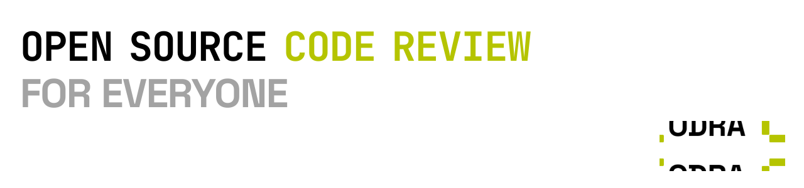

# Codra

<picture>
  <source media="(prefers-color-scheme: dark)" srcset="./public/assets/codra-gh-banner-dark.svg">
  <source media="(prefers-color-scheme: light)" srcset="./public/assets/codra-gh-banner-light.svg">
  
</picture>

Open source PR review infrastructure for Cloudflare Workers.

Codra listens to GitHub pull request events, runs AI-powered review jobs, posts inline findings back to the PR, and gives you a dashboard to inspect jobs, repos, models, and review history.

[](https://deploy.workers.cloudflare.com/?url=https://github.com/devarshishimpi/codra)

## What Codra Does

- Reviews pull requests automatically on `opened`, `synchronize`, `ready_for_review`, and `reopened`
- Supports mention-triggered reviews
- Posts inline PR comments and updates GitHub check runs
- Queues review jobs through Cloudflare Queues so webhook intake stays fast
- Stores job history, repo settings, and review metadata in external Postgres through Cloudflare Hyperdrive
- Ships with a built-in dashboard for jobs, repos, stats, settings, and replay/debug workflows
- Lets each repository override review behavior, skip globs, labels, and model routing

## Stack

- Cloudflare Workers + Hono
- React + Vite
- Cloudflare Queues + KV + Workers AI
- External Postgres via Cloudflare Hyperdrive and `postgres`
- GitHub App webhooks + checks + PR review APIs

## Architecture

1. GitHub sends a webhook to Codra.
2. Codra validates the signature and loads repo config from the database.
3. A review job is inserted into Postgres via Hyperdrive and queued on Cloudflare Queues.
4. The worker consumes the job, fetches the PR diff, runs model review passes, and formats findings.
5. Codra posts inline comments plus a summary review back to GitHub and stores the run for the dashboard.

## Deploy To Cloudflare

Use the button above to clone and deploy Codra to your own Cloudflare account.

Cloudflare can provision or bind the Cloudflare-native resources defined in [`wrangler.jsonc`](/wrangler.jsonc), including:

- `APP_KV`
- `REVIEW_QUEUE`
- Workers AI binding
- static asset hosting from `dist/client`

What the deploy button does not provision for you:

- your Postgres database and Hyperdrive config
- GitHub App credentials
- GitHub OAuth app credentials
- Gemini API key

That means the deploy flow is best thought of as "Cloudflare infrastructure bootstrap", followed by a short secrets setup step.

For this repo's own production deployment, the checked-in route and binding IDs in [`wrangler.jsonc`](/wrangler.jsonc) are intentional. They are what keep `codra.run` deploying against the same Worker, KV namespace, and queues. If you fork Codra, replace those values with your own resources.

## Required Secrets And Local DB Vars

Codra expects these secrets in Cloudflare production and in local `.dev.vars` for development:

- `APP_PRIVATE_KEY`
- `GITHUB_APP_ID`
- `GITHUB_APP_WEBHOOK_SECRET`
- `GITHUB_CLIENT_ID`
- `GITHUB_CLIENT_SECRET`
- `GEMINI_API_KEY`

Local development and migrations also need:

- `CLOUDFLARE_HYPERDRIVE_LOCAL_CONNECTION_STRING_HYPERDRIVE` for local Worker DB access
- `DATABASE_URL` for local/admin migrations

Optional, only for DLQ inspection and replay APIs:

- `CF_API_TOKEN`
- `CF_ACCOUNT_ID`

The expected local shape is already documented in [`.dev.vars.example`](/.dev.vars.example).

In the checked-in production Wrangler config, these values are regular environment vars rather than secrets:

- `AUTH_CALLBACK_URL`
- `DASHBOARD_ALLOWED_USERS`

## Dashboard Auth

Codra now uses GitHub OAuth for dashboard access instead of a shared password. The main deployment only accepts GitHub users listed in `DASHBOARD_ALLOWED_USERS`.

Production setup requires:

- one GitHub OAuth App for the dashboard
- the existing GitHub App for webhook/check/review automation

## Postgres + Hyperdrive Setup

Codra uses Cloudflare Hyperdrive to connect Workers to an external Postgres database. The database can be self-hosted or managed, and can sit behind PgBouncer.

### 1. Create a Postgres database

Create a Postgres database and keep a direct connection string available for migrations.

### 2. Create a Hyperdrive config

Point Hyperdrive at your database or PgBouncer endpoint:

```bash
npx wrangler hyperdrive create codra-postgres --connection-string "postgresql://<user>:<password>@<host>:5432/<db>"
```

Copy the returned Hyperdrive ID into the `HYPERDRIVE` binding in [`wrangler.jsonc`](/wrangler.jsonc).

### 3. Run migrations

Codra applies SQL migrations automatically during deploy:

- [`db/migrations/001_initial.sql`](/db/migrations/001_initial.sql)
- [`db/migrations/002_normalize_existing_schema.sql`](/db/migrations/002_normalize_existing_schema.sql)

On a fresh database, `npm run deploy` initializes `001` and then applies newer migration files in order. On an existing database that predates migration tracking, deploy marks `001` as already applied and then runs later migrations.

For local/admin runs, set `DATABASE_URL` and run:

```bash
npm run migrate
```

### 4. Configure local development

For `wrangler dev`, set Hyperdrive's local connection-string override in `.dev.vars`:

```text
CLOUDFLARE_HYPERDRIVE_LOCAL_CONNECTION_STRING_HYPERDRIVE="postgresql://<user>:<password>@localhost:5432/<db>"
```

Do not commit a real local connection string.

### 5. Keep one direct URL around for admin work

For schema/admin tooling, keep a direct Postgres or PgBouncer connection string handy as `DATABASE_URL`. The deployed worker should use the Hyperdrive binding, while migration tools connect directly.


## Repository Config

Each connected repo can be configured directly through the Codra dashboard. You can toggle reviews, customize model routing (including fallbacks and size-based overrides), set custom review rules, and manage labels.

The dashboard provides a visual interface to manage all your repositories in one place, ensuring consistent and predictable AI review behavior across your organization.

## License

Codra is licensed under the **GNU Affero General Public License v3.0 (AGPL-3.0)**. 

### What this means:
- **Keep it Open**: If you modify Codra and host it as a service (SaaS), you **must** make your modified source code available to your users.
- **Hosted Version**: The maintainer (Devarshi Shimpi) reserves the right to provide a separate, proprietary hosted version of Codra.
- **Contributions**: By contributing to this repository, you agree that your contributions will be licensed under the same AGPL-3.0 license.

See the [LICENSE](LICENSE) file for the full text.
