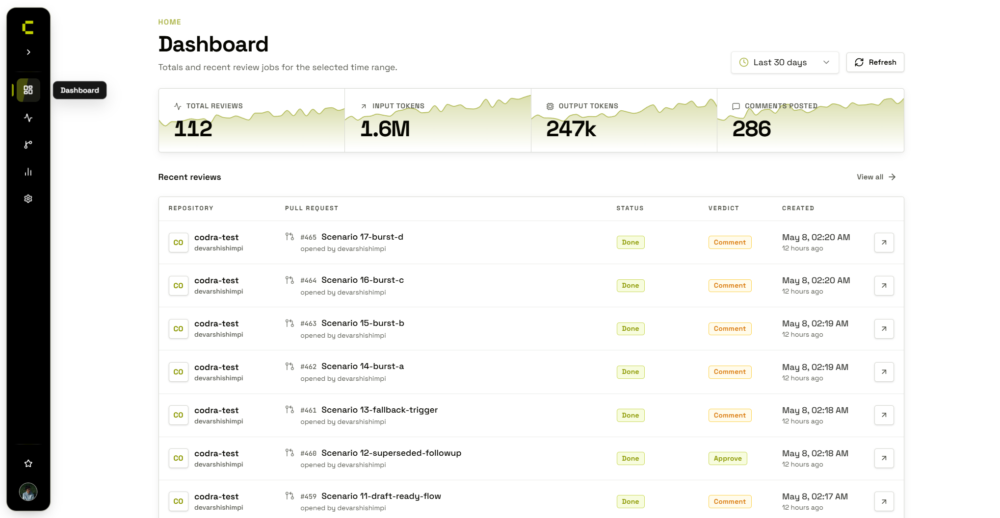

  <h1>OpenCodra</h1>

  

    Self-hosted AI code review for GitHub and Bitbucket pull requests. 
    Cloudflare-native, queue-backed, repository-aware, and built for teams that want to own their review engine.
  

  

    
    
    
    
  

  

    <a href="https://github.com/michnicki/opencodra/issues">Issues</a>
    |
    <a href="CONTRIBUTING.md">Contributing</a>
    |
    <a href="LICENSE">License</a>
  

OpenCodra listens to GitHub and Bitbucket pull request events, runs AI-powered review jobs, posts inline findings back to the PR, and gives you a dashboard to inspect jobs, repositories, model routing, review history, and failed queue runs.

> **OpenCodra is a fork of [Codra](https://github.com/devarshishimpi/codra) by Devarshi Shimpi.** It exists for one reason: the original Codra requires a **Contributor License Agreement (CLA)** to accept contributions. OpenCodra removes that requirement — contributions are accepted under AGPL-3.0 with **no CLA**. Same license, original copyright retained; this fork adds Bitbucket support and welcomes open contributions.

> **Beta** - OpenCodra is under active development. Expect rough edges, missing features, and breaking changes between releases. Feedback and bug reports are welcome via [GitHub Issues](https://github.com/michnicki/opencodra/issues).

## Why OpenCodra

- **No CLA to contribute**: OpenCodra accepts contributions under AGPL-3.0 with no Contributor License Agreement — the barrier that motivated this fork.
- **Own the whole review loop**: Run the GitHub/Bitbucket app, Cloudflare Worker, queue, database, model credentials, and dashboard under your own control.
- **Review with repository context**: OpenCodra checks pull request diffs for correctness, security, performance, maintainability, and repo-specific patterns.
- **Configure each repository**: Tune triggers, skipped paths, draft handling, mention reviews, labels, custom rules, and review budgets from the dashboard.
- **Route models deliberately**: Use global defaults, per-repo model chains, fallbacks, and size-based overrides for larger pull requests.
- **Operate the system**: Inspect job history, PR findings, webhook deliveries, model usage, and dashboard stats.

## Features

- Automatic reviews on `opened`, `synchronize`, `ready_for_review`, and `reopened` pull request events (GitHub and Bitbucket)
- Mention-triggered reviews for on-demand analysis
- Inline PR review comments, summary reviews, and status updates (GitHub check runs / Bitbucket Code Insights)
- Queue-backed processing through Cloudflare Queues
- GitHub and Bitbucket OAuth dashboard authentication
- External PostgreSQL storage through Cloudflare Hyperdrive
- Dashboard-managed LLM providers for OpenAI, OpenRouter, Anthropic, Google, and Cloudflare models
- Repository settings for labels, skipped globs, custom rules, and model routing

## How It Works

1. GitHub or Bitbucket sends OpenCodra a pull request webhook.
2. OpenCodra verifies the signature and loads repository review settings.
3. A review job is stored in PostgreSQL and queued on Cloudflare Queues.
4. The Worker consumes the job, fetches the PR diff, runs model review passes, and formats findings.
5. OpenCodra posts inline comments and a summary review back to the pull request.
6. The dashboard keeps the job history, findings, logs, and stats available for operators.

## Stack

- **Worker**: Cloudflare Workers, Hono, Wrangler
- **Dashboard**: React, Vite, Tailwind CSS, Radix UI, Recharts
- **Data**: PostgreSQL, Cloudflare Hyperdrive, Cloudflare KV
- **Queues**: Cloudflare Queues and Workflows
- **Models**: OpenAI, OpenRouter, Anthropic, Google, and Cloudflare providers
- **VCS**: GitHub App and Bitbucket Cloud webhooks, checks/Code Insights, reviews, and OAuth
- **Quality**: TypeScript, Zod, Vitest, Playwright browser tests

## Documentation

Setup and operations notes live in this repository:

- [Contributing](CONTRIBUTING.md)
- [Security policy](SECURITY.md)

## Contributing

Contributions are welcome — **no Contributor License Agreement required**. Please read [CONTRIBUTING.md](CONTRIBUTING.md) before opening a pull request.

## License

OpenCodra is licensed under the [GNU Affero General Public License v3.0](LICENSE). It is a fork of [Codra](https://github.com/devarshishimpi/codra) by Devarshi Shimpi; the original copyright is retained as required by the license.
