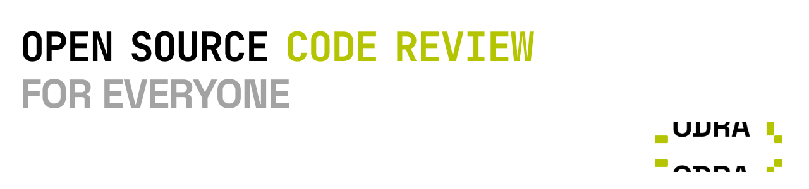

# Codra

<picture>
  <source media="(prefers-color-scheme: dark)" srcset="./assets/codra-gh-banner-dark.svg">
  <source media="(prefers-color-scheme: light)" srcset="./assets/codra-gh-banner-light.svg">
  
</picture>

Open source PR review infrastructure for Cloudflare Workers.

Codra listens to GitHub pull request events, runs AI-powered review jobs, posts inline findings back to the PR, and gives you a dashboard to inspect jobs, repos, models, and review history.

[](https://deploy.workers.cloudflare.com/?url=https://github.com/devarshishimpi/codra)

## What Codra Does

- Reviews pull requests automatically on `opened`, `synchronize`, `ready_for_review`, and `reopened`
- Supports mention-triggered reviews through `.codra.yml`
- Posts inline PR comments and updates GitHub check runs
- Queues review jobs through Cloudflare Queues so webhook intake stays fast
- Stores job history, repo settings, and review metadata in Neon Postgres
- Ships with a built-in dashboard for jobs, repos, stats, settings, and replay/debug workflows
- Lets each repository override review behavior, skip globs, labels, and model routing

## Stack

- Cloudflare Workers + Hono
- React + Vite
- Cloudflare Queues + KV + Workers AI
- Neon Postgres via `@neondatabase/serverless`
- GitHub App webhooks + checks + PR review APIs

## Architecture

1. GitHub sends a webhook to Codra.
2. Codra validates the signature and loads repo config from `.codra.yml`.
3. A review job is inserted into Neon and queued on Cloudflare Queues.
4. The worker consumes the job, fetches the PR diff, runs model review passes, and formats findings.
5. Codra posts inline comments plus a summary review back to GitHub and stores the run for the dashboard.

## Deploy To Cloudflare

Use the button above to clone and deploy Codra to your own Cloudflare account.

Cloudflare can provision or bind the Cloudflare-native resources defined in [`wrangler.jsonc`](/C:/Users/devar/Dropbox/Documents/GitHub/codra/wrangler.jsonc), including:

- `APP_KV`
- `REVIEW_QUEUE`
- Workers AI binding
- static asset hosting from `dist/client`

What the deploy button does not provision for you:

- your Neon database
- GitHub App credentials
- Gemini API key
- dashboard password

That means the deploy flow is best thought of as "Cloudflare infrastructure bootstrap", followed by a short secrets setup step.

For this repo's own production deployment, the checked-in route and binding IDs in [`wrangler.jsonc`](/C:/Users/devar/Dropbox/Documents/GitHub/codra/wrangler.jsonc) are intentional. They are what keep `codra.devarshi.dev` deploying against the same Worker, KV namespace, and queues. If you fork Codra, replace those values with your own resources.

## Required Secrets

Codra expects these secrets in Cloudflare production and in local `.dev.vars` for development:

- `APP_PRIVATE_KEY`
- `GITHUB_APP_ID`
- `GITHUB_APP_WEBHOOK_SECRET`
- `GEMINI_API_KEY`
- `NEON_DATABASE_URL`
- `DASHBOARD_PASSWORD`

Optional, only for DLQ inspection and replay APIs:

- `CF_API_TOKEN`
- `CF_ACCOUNT_ID`

The expected local shape is already documented in [`.dev.vars.example`](/C:/Users/devar/Dropbox/Documents/GitHub/codra/.dev.vars.example).

## Neon Postgres Setup

Codra currently supports Neon only. The server code uses `@neondatabase/serverless` directly and reads a single `NEON_DATABASE_URL` binding, so if you OSS this repo, Neon should be the documented database path.

### 1. Create a Neon project

Create a project and database in Neon, then open the connection dialog for that database.

### 2. Copy the pooled connection string

For the Worker runtime, use the pooled Neon connection string. It should include `-pooler` in the hostname and look like this:

```text
postgresql://<user>:<password>@<endpoint>-pooler.<region>.aws.neon.tech/<db>?sslmode=require&channel_binding=require
```

### 3. Run the migration

Codra now ships with a single bootstrap migration:

- [`db/migrations/001_initial.sql`](/C:/Users/devar/Dropbox/Documents/GitHub/codra/db/migrations/001_initial.sql)

You can run it from the Neon SQL editor or with your preferred Postgres client.

### 4. Add the database URL to Cloudflare

Set the pooled Neon URL as a Worker secret:

```bash
npx wrangler secret put NEON_DATABASE_URL
```

For local development, put the same value in `.dev.vars`.

### 5. Keep one direct URL around for admin work

For schema/admin tooling, keep a direct non-pooled Neon connection string handy as well. The deployed worker should use the pooled URL, but direct connections are still useful for migration tools or session-level database operations.


## Repository Config

Each connected repo can add a `.codra.yml` file to customize behavior. Codra loads this file, caches it in KV, and persists the parsed snapshot in Neon.

Example:

```yaml
review:
  on: [opened, synchronize, ready_for_review, reopened]
  ignore_drafts: true
  mention_trigger: "@codra-app"
  max_files: 15
  custom_rules:
    - "Prefer narrow, actionable findings over broad style comments."

model:
  main: "gemma-4-31b-it"
  fallbacks:
    - "gemma-3-27b"
    - "@cf/zai-org/glm-4.7-flash"
```
